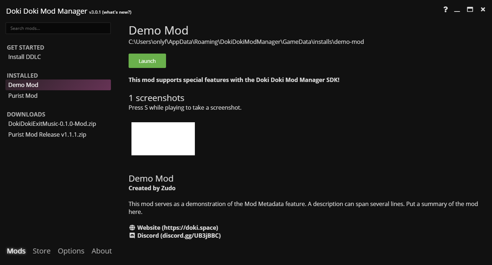

Version 3 of Doki Doki Mod Manager introduced Mod Metadata. With this feature, mod authors can include information about
their mod, such as a description or a link to a Discord server.

## Demonstration

This is a demo of what users will see if you add metadata to your mod.

## Getting Started

Metadata is added using a `ddmm-mod.json` file, which is distributed with your mod's zip file.

The `ddmm-mod.json` file can be anywhere in your zip file, as long as there is no more than one. When the mod is installed,
this file will be read.

Here is the basic structure of the file. Note that, if you wish to include quotes in a text field, you must escape them
with a backslash (e.g. `The character called \"Monika\"`)

    {
        "name": "Name Here",
        "description": "Description Here",
        "author": "Author Here",
        "uses_sdk": true,
        "discord": "discordID",
        "website": "https://example.org"
    } 
    
## Fields

* `name` - the name of your mod
* `description` - a brief description of what your mod is about
* `author` - the name of the author or authors
* `uses_sdk` - `true` if your mod uses achievements, `false` if not
* `discord` - An invite code for your Discord server (e.g. if your invite URL is `https://discord.gg/abc123`, specify `abc123`)
* `website` - The link to your mod's website
    
## Integrating into your build process

If you want to use the DDLC Mod Template, download the [latest development build](https://github.com/Monika-After-Story/DDLCModTemplate/archive/master.zip).
This way, when you choose the _Create Distributions_ option in Ren'Py, the `ddmm-mod.json` file will be included in the build. 
