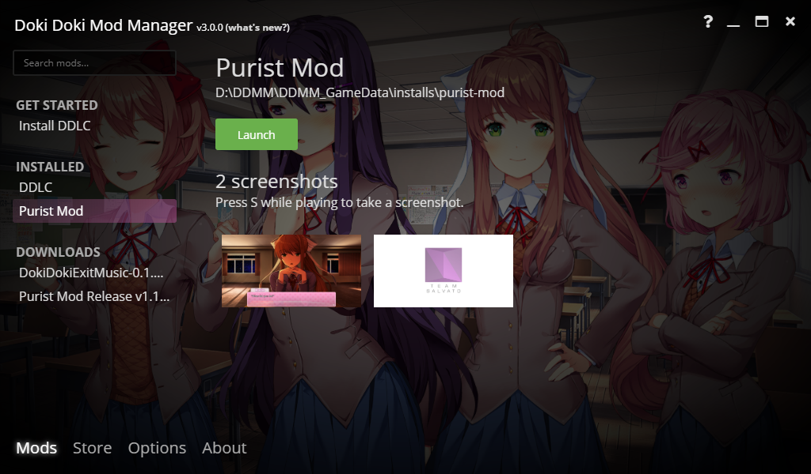

Welcome to the third ever public build of Doki Doki Mod Manager version 3! Here's what's new.

## New Features

### Redesign

Doki Doki Mod Manager has a new user interface! Get to your mods quicker than before with the slick new UI design.

### macOS Support

For the first time ever, Doki Doki Mod Manager is available on macOS! Thanks to **Sgtcoolhero** on the [DDMM Discord](https://doki.space/discord) for helping me get this working.

### Screenshots

Take screenshots with the S key in game, and they will appear in Doki Doki Mod Manager.

### Mod Metadata

Are you a mod developer? You can add information to your mod, such as the name, author or even a Discord link. When someone plays your mod, they will get to see this extra info. Tutorial for this coming soon.

### Support for everything and anything

Mods downloaded as .rar files, among others, can now be installed with no additional steps. This for you, DDMC Discord.

### and...

* You can _finally_ move the install folder to a different location. SSD users rejoice!
* Customise all the things. Discord Rich Presence, save locations and the Achievements SDK can be configured.

## Bugs Squashed in the .2 patch

* **Fixed a bug that would cause Linux and macOS users to crash due to an oversight when setting Windows jumplist tasks.**
* Removed an accidental change to the navbar.
* Improved wording for the mod screenshot info.

## It's new...

... so there may be bugs I don't know about. Please let me know [on GitHub](https://github.com/DokiDokiModManager/Mod-Manager/issues) or [by email](mailto:zudo@doki.space) if you find one!
