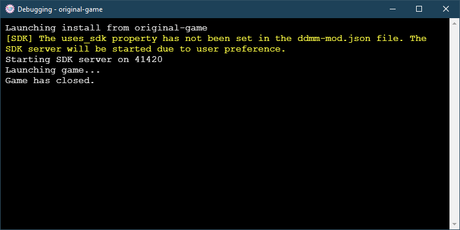

# Mod debugging

If you are testing your mod with Doki Doki Mod Manager, you may find it useful to enable debugging options. These can be found under the **Debugging Options** section on the **Options** tab.

## Debug logging

Check the **Enable Debug Logging** box to enable the debug log when launching mods. This is a window that shows information from the game as it runs, such as STDOUT / STDERR output and information from the SDK server. This is especially useful if you are adding achievements to your mod.

## Ren'Py launch options

You can skip the splash screen and title menu by enabling the corresponding check boxes. This may break things, so they should only be enabled for testing purposes. For example, you may end up without a name for the main character.
