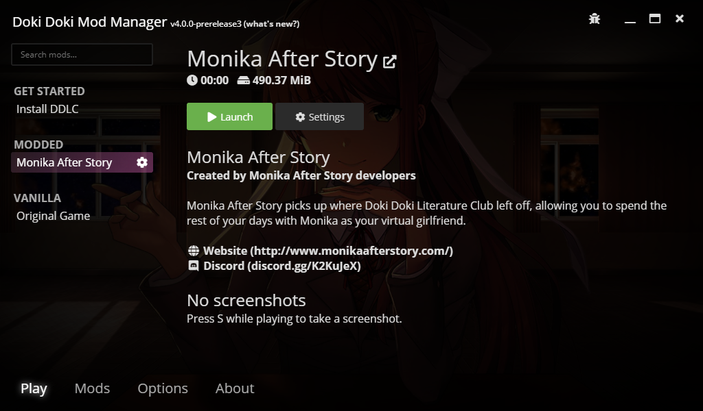

# Mod metadata and customisation

Doki Doki Mod Manager has a metadata system which allows you to display information about your mod to players in the game preview screen.

## Adding metadata

This is achieved by including a `ddmm-mod.json` file in your mod's distribution.

### Example
    {
        "name": "Name Here",
        "description": "Description here",
        "author": "Author names here",
        "uses_sdk": true,
        "discord": "discordID",
        "website": "https://example.org"
    } 
    
### Fields

* `name` - the name of your mod
* `description` - a brief description of what your mod is about
* `author` - the name of the author or authors
* `uses_sdk` - true if your mod uses achievements, false if not
* `discord` - An invite code for your Discord server (e.g. if your invite URL is https://discord.gg/abc123, specify abc123)
* `website` - The link to your mod’s website

All fields are optional, but recommended.

### Tips
This file must be valid JSON or it will be ignored. There are many tools online that allow you to validate JSON, such as [JSON Formatter](https://jsonformatter.org/json-editor).

Although it doesn't technically matter where in your mod's you place the file, it should usually be in the root directory. It **cannot** be in a `.rpa` file, and **must** be named `ddmm-mod.json`. Having multiple `ddmm-mod.json` files in your mod may cause undefined behaviour.

## Mod background

You can add a background to your mod's distribution that will replace the user's background when they select your mod.

Your image should be named `ddmm-bg.png` and be a PNG image with a resolution of at least 1280x720. The same rules about file location as the `ddmm-mod.json` file apply.
