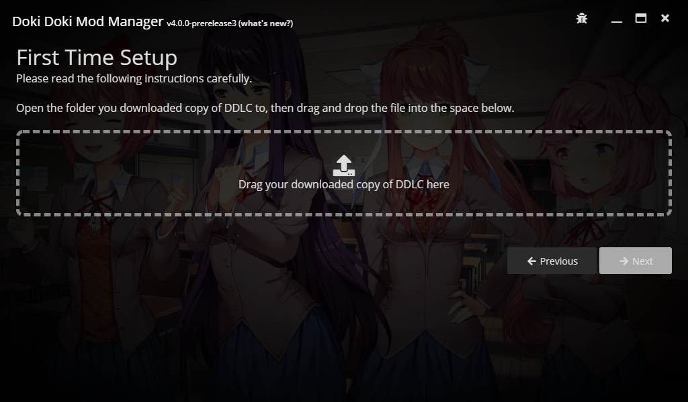

# First time setup

Your next step is to download and install a copy of the Doki Doki Literature Club game. 

If you've followed the tutorial up until now, you should be on the Doki Doki Mod Manager splash screen. Click the **Get Started** button.

## Download and install DDLC

::: tip
If you are prompted to choose your save location and favourite character, you already have a copy of DDLC downloaded. You can skip to the [last step](#final-settings) on this page.
:::

Doki Doki Mod Manager requires a clean copy of DDLC, which will be used as the base on which your mods are installed. It's up to you to download this, so open up a web browser and navigate to the [DDLC Website](https://ddlc.moe/). Even if you've played DDLC on Steam before, you still need to download a new copy.

::: danger
If you are using Safari on macOS, the default settings will cause the downloaded copy of the game to automatically unzip itself. This behaviour interferes with Doki Doki Mod Manager, so please follow [this guide](https://www.addictivetips.com/mac-os/stop-automatically-unzipping-files-in-safari/) to disable it.
:::

Click the **Download Now** button and follow the instructions. Pick the appropriate download for your operating system - Windows and Linux users should pick the file named **DDLC (Windows)** and macOS users should choose **DDLC (Mac)**.

Once the download has finished, click **Next**, then drag and drop the downloaded file into the box.

If you've done everything correctly, click **Next** to continue.

## Final settings

The last two options will allow you to change Doki Doki Mod Manager's installation directory. This is usually a good idea, especially if you have a PC with multiple storage devices. You can also pick your favourite character, who will be displayed as the background image.

Both of these options can be changed later, if you want. Once you've changed them to your liking, click the **Finish** button. Congratulations, you have set up Doki Doki Mod Manager!
