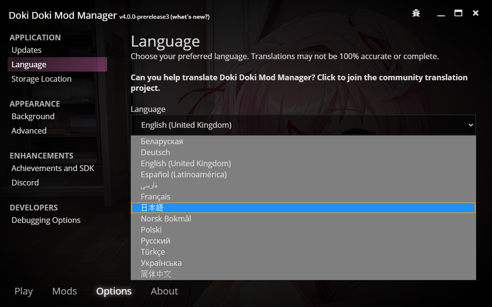
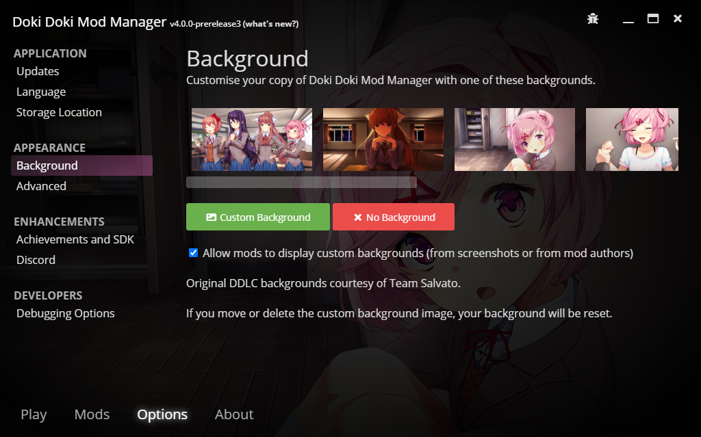

# Options

Doki Doki Mod Manager has many configuration options that you might like to change. This article covers some options that will be important to the majority of users.

Open the **Options** tab to browse the options.

## Updates

Occasionally, you may receive an update to Doki Doki Mod Manager. Visit the **Updates** section to check, and install any available updates.

## Language

Speak something other than English? Choose a different language from the **Language** section. Not all languages are fully translated.

## Background

Want to change the look and feel of Doki Doki Mod Manager? You can pick a new background in the **Background** section, or even add your own.

You can also choose to disable mod backgrounds here, which may improve performance.
