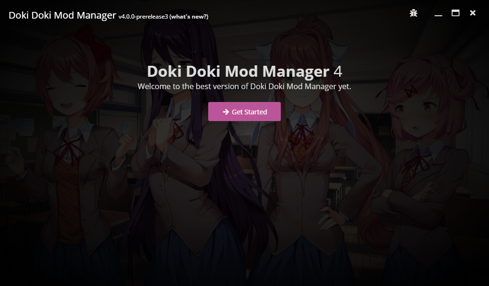

# Installation

Doki Doki Mod Manager is available on all the major desktop operating systems. Each one has slightly different setup instructions, so please read them carefully.

## Download 
To get started, visit the Doki Doki Mod Manager [homepage](https://doki.space/) and choose the appropriate download for your operating system.

## Operating-system specific steps

### Windows

::: warning
You may be shown a message saying "Windows protected your PC", which is a false positive. Click **More info** then **Run anyway** to continue with the installation.
:::

Download and run the installer, which should be called `ddmm-4.0.0.exe` or something similar. The installation will complete automatically.

### macOS

::: warning
You may receive a message saying "Doki Doki Mod Manager can't be opened because it was not downloaded from the Mac App Store." [Follow the instructions here](https://www.wikihow.com/Install-Software-from-Unsigned-Developers-on-a-Mac) to continue.
:::

Download and open the file, which should be called `ddmm-4.0.0.dmg` or something similar. Next, drag the Doki Doki Mod Manager icon into your Applications folder, then run the application.

### Linux

::: tip
For the best experience, download and install [AppImageLauncher](https://github.com/TheAssassin/AppImageLauncher) on your system first. This allows proper desktop integration for Doki Doki Mod Manager.
:::

Download the AppImage, which should be called `ddmm-4.0.0.AppImage` or something similar. When this is done, launch it from your desktop environment or from the terminal:

    $ chmod +x ./ddmm-4.0.0.AppImage
    $ ./ddmm-4.0.0.AppImage
    
(replace `ddmm-4.0.0.AppImage` with the name of the file you downloaded)

## Start

Once you see this screen, you're ready to move on!

