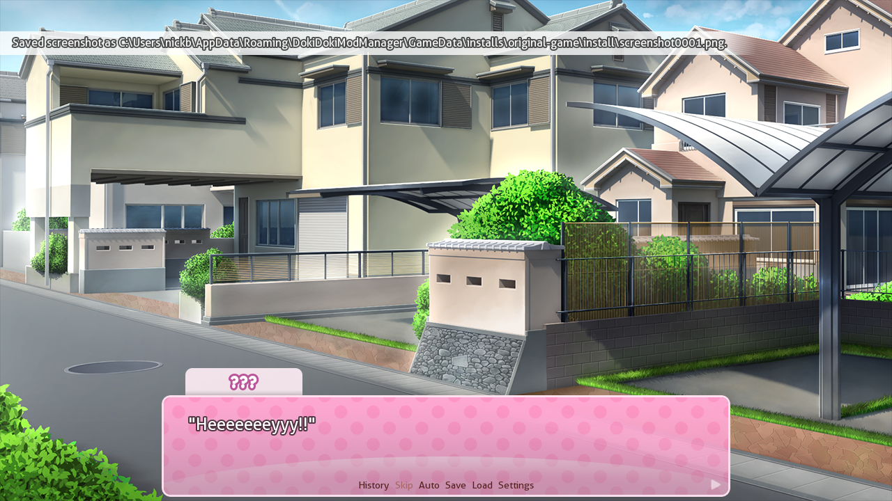
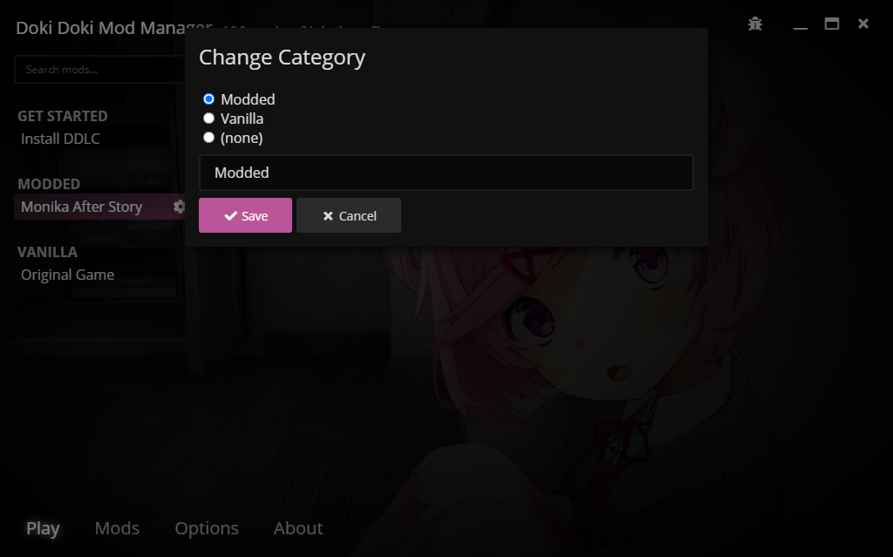

# Managing mods

Doki Doki Mod Manager has many features that help you organise and maintain your installed mods. This article will go through the options you are most likely to use.

## Take screenshots

Press S while playing to take a screenshot. A notification will appear in game when you do this.

When you stop playing, you'll be able to view screenshots on the game preview screen. Click on one to view it in your system's file browser.

## Categories

You can organise your installed mods into categories to make finding them easier. On the **Play** tab, choose the mod you want and click the **Settings** button. Choose **Change Category** to open the category picker.

Use the buttons to choose a category, or enter a new category in the text box below. Click **Save**, and your mod will be sorted into that category.

::: tip
Remember, you can use the search field to find mods if you have a lot of them installed. 
:::

## Uninstall and Delete Save Data

::: danger
Being reckless with these options could lead to data loss! Please be careful.
:::

If you no longer want to play a mod you installed, you can uninstall it. From the game's settings menu, click **Uninstall**. Once you have confirmed your actions, the mod will be removed from the **Play** tab and deleted from your system. Your save data will be erased too, unless you are using the [global save](#) option.

Similarly, if you want to start over and delete your save data, this can be done from the game's settings menu with the **Delete Save Data** option. This option is not applicable when using global saves. 
