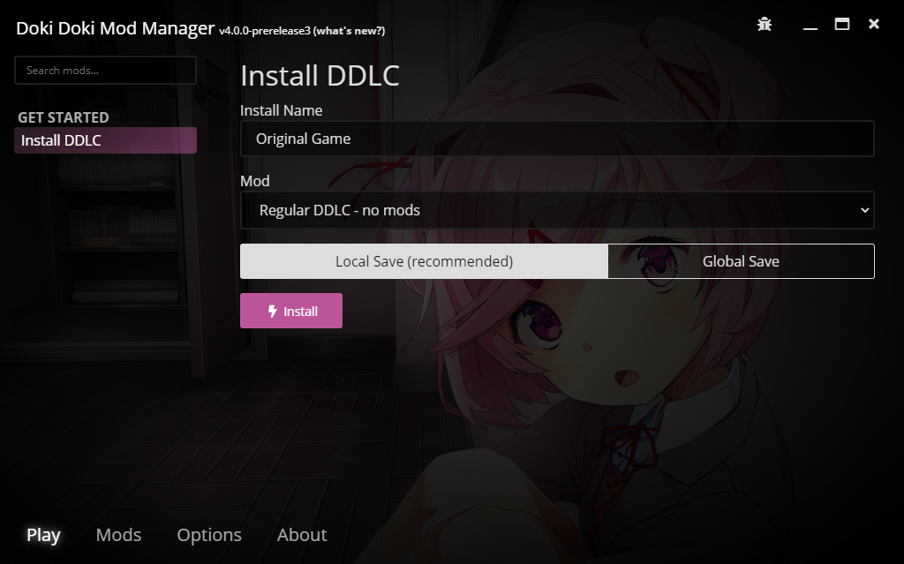

# Installing your first mod

Now you have a working installation of Doki Doki Mod Manager, your next step is to choose a mod to play. If you're new to DDLC modding, or aren't sure what you're trying to play yet, please read the whole article.

## Install DDLC without mods

Want to play the original game again? That's fine! In the **Play** tab, select **Install DDLC**. Fill in a name, make sure **Regular DDLC** is selected, then click **Install**.

Installation will take a few minutes at most. Once it's done, you'll be brought to the game preview screen. Click **Launch** and DDLC will start. Doki Doki Mod Manager will minimise itself to get out of your way, and it'll come back when you finish playing.

## Install a mod from the internet

Doki Doki Mod Manager really shines when you give it some mods to work with. Luckily for you, there's a whole world of mods just waiting to be discovered!

Go to the **Mods** tab, then click on **Featured Mods**, where you'll find a handful of mods that we recommend you play. Click **Download** next to the mods you want.

Want more? Click on **Doki Doki Mod Club**. There, you'll find a much larger catalogue of mods. However, not all of these have been tested, and some aren't able to be downloaded through Doki Doki Mod Manager.

Once you've picked out the mods you want to play, click **Your Mods** to view all the mods you've downloaded. Downloads that aren't finished yet can be found under **Downloads**.

Click **Install** next to the mod you want to play, then fill in a name and click **Install** again. Your mod will be installed, and you're ready to start playing!

## Install a mod from your PC

Already downloaded a mod? It's fairly straightforward to install it through Doki Doki Mod Manager. In the **Play** tab, select **Install DDLC**, then choose **Mod isn't listed here** from the **Mod** dropdown box.

You can then click to browse for a mod. Doki Doki Mod Manager supports `.zip` files out of the box, as well as `.7z` and `.rar` files.
