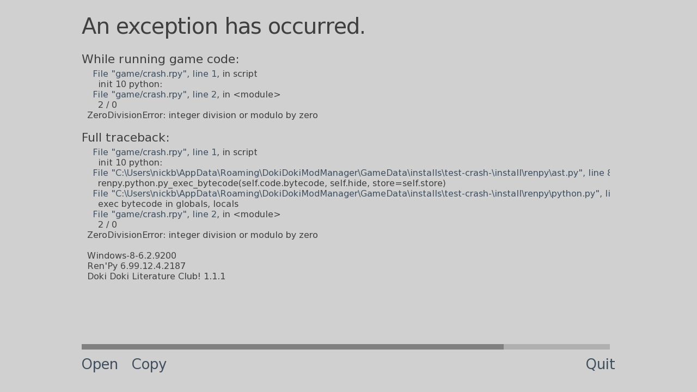

# Fix mod installation problems

Although rare, sometimes errors can occur when installing mods. If you're having an issue with mods, use this article to find the cause and/or fix for your problem.

## I see a regular DDLC splash screen instead of the mod I was expecting

Doki Doki Mod Manager accepts `.zip`, `.rar` and `.7z` archive files. If you selected the wrong file, it will still try to install the contents of it as if it were a mod. Make sure you selected the mod you wanted to install, and try installing again. 

## The game crashes, or behaves erratically

The mod has been installed incorrectly for some reason. You may see an error screen like the one below.

Check if your mod has any special installation instructions, which can usually be found on the download page or included in the mod files. If these don't help, please [ask us first](#i-need-more-help) before contacting the mod author.

## `Command failed` or `end of central directory record signature not found`

This usually means the mod you downloaded (`.zip`) contains corrupted data. You will need to download the mod again.

If this doesn't help, you may want to check if you can open the mod in your computer's file browser or archiving tool. If this doesn't work, get in touch with the mod author, so they can check that their downloads are working.

## I need more help

If you're just trying to play the mod, your first point of contact should **not** usually be the mod author. Please join the [Doki Doki Mod Manager Discord](https://doki.space/discord) and ask there first, so we can find the cause of the problem.

If you're the author of the mod, check the [packaging guidelines](mod-packaging.md) for best practices. You're also welcome to join the Discord server for more help.
