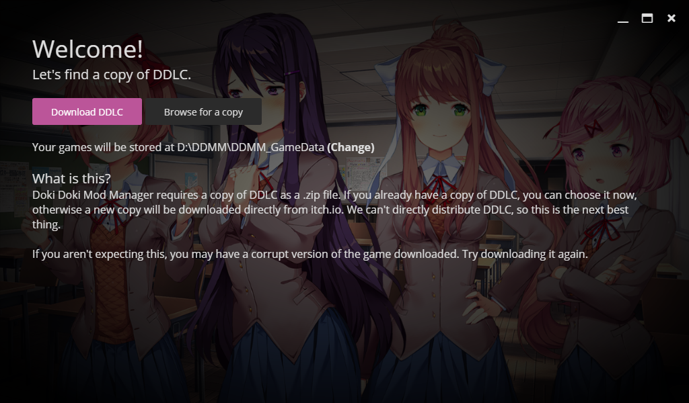

Doki Doki Mod Manager is an application that runs on your computer, so you need to download and install it before getting started.

## Download

Visit [the DDMM homepage](https://doki.space) and download the latest version for your type of computer. This will be:

* Windows - `.exe`
* macOS - `.dmg`
* Linux - `.AppImage`

Once your download is done, open it from your file manager (you may need to use the terminal on Linux). On macOS, you will need to drag DDMM into your Applications folder, then launch it yourself.

**Windows may warn you that DDMM is not commonly downloaded and may be unsafe. This is a false positive - choose "More Info" then "Run Anyway".**

**Similarly, macOS will warn you that DDMM is not made by a trusted developer and refuse to launch. You can override this by visiting System Prefences then Security and Privacy.**

## Setup

Doki Doki Mod Manager will prompt you to either download or find a copy of Doki Doki Literature Club. If you've downloaded DDLC before from the [ddlc.moe](https://ddlc.moe) website, you may still have the game as a `.zip` file. If this is the case, click "Find a copy" and locate the game.

If you've played DDLC through Steam, or have never played the game before, click "Download" to start downloading a copy of the game. This will take a couple of minutes to half an hour, depending on your internet connection. 

## Play

Once you've obtained a copy of DDLC, you are ready to move on!

**[Next Page](install-ddlc)**